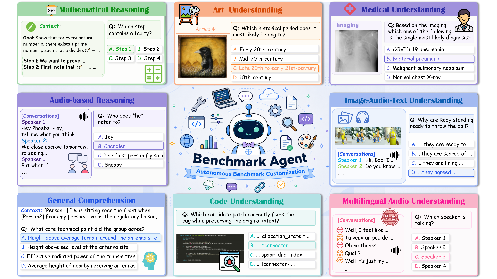
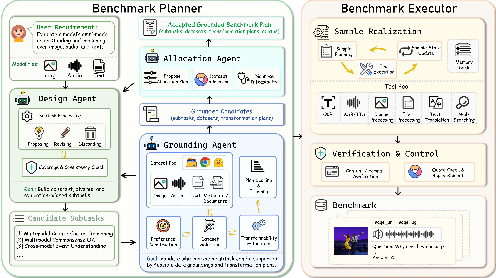

<div align="center">

# 🌍 Benchmark Everything Everywhere All at Once

<a href="https://benchmarkagent.github.io/"></a>&nbsp;
<a href="https://arxiv.org/abs/2606.06462"></a>&nbsp;

<br/>



<br/>

<strong>Stop writing static benchmarks. Start generating them.</strong><br/>
<em>From a natural-language evaluation goal to a verified, executable benchmark dataset, fully automated.</em>

</div>

---

## 🌟 Introduction

**Benchmark Everything Everywhere All at Once** introduces **Benchmark-Agent**, a fully autonomous agentic system for benchmark construction and customization.

Given a high-level evaluation goal in natural language, **Benchmark-Agent** orchestrates the complete pipeline: requirement analysis, subtask design, data grounding, transformation planning, sample realization, and quality control, with no manual dataset curation required.

---

## 🧠 Framework Overview

<p align="center">
  
</p>

<p align="center">
  <code>📝 Requirement</code> &nbsp;→&nbsp;
  <code>🧩 Subtask Design</code> &nbsp;→&nbsp;
  <code>🔍 Data Grounding</code> &nbsp;→&nbsp;
  <code>📊 Allocation</code> &nbsp;→&nbsp;
  <br/>
  <code>⚙️ Execution</code> &nbsp;→&nbsp;
  <code>✅ Verified Benchmark</code>
</p>

---

## ✨ Key Features

<div align="center">

| | Feature | Description |
|:---:|:---|:---|
| 🤖 | **Autonomous Customization** | End-to-end benchmark generation from natural-language requirements |
| 🧭 | **Agentic Planner–Executor** | Specialized agents orchestrate design, grounding, allocation, and sample generation at each stage |
| 🔧 | **Autonomous Tool Selection** | Agents dynamically choose datasets, transformation tools, and next-step actions |
| 🌐 | **Multimodal & Diverse Evaluation** | Text, image, audio, and cross-modal benchmarks across reasoning, understanding, and domain-specific tasks |
| 🔄 | **Reproducible Pipeline** | Full intermediate caching; incremental reruns without redundant work |

</div>

---

## 📌 Table of Contents

- [🔥 News](#-news)
- [⚡ Quick Start](#-quick-start)
  - [📥 Installation](#-installation)
  - [🔑 Configuration](#-configuration)
  - [📂 Prepare Inputs](#-prepare-inputs)
  - [🚀 Run](#-run)
- [✨ How Benchmark-Agent Works](#-how-benchmark-agent-works)
- [📖 Citation](#-citation)

---

## 🔥 News

- **[2026-06]** 🎉🎉 Benchmark-Agent 🎉🎉 is open-source! Write your evaluation goal in natural language and let the agent handle the rest. Get started with the examples in [`user_queries/`](user_queries/).
- **[2026-06]** 📄 Our paper [*Benchmark Everything Everywhere All at Once*](https://arxiv.org/abs/2606.06462) is now on arXiv.
- **[2026-06]** 🌐 Check out the [project page](https://benchmarkagent.github.io/) for benchmark examples across 📝 text, 🎙️ audio, and 🖼️ image tasks.

---

## ⚡ Quick Start

### 📥 Installation

```bash
git clone https://github.com/Shiyun-x/Benchmark-Agent.git
cd Benchmark-Agent

uv venv --python 3.11
source .venv/bin/activate
uv pip install -e .
```

---

### 🔑 Configuration

All API and model settings are configured in **`utils/resources/models.yaml`**:

```yaml
# API credentials
api:
  api_key: "your_api_key"
  base_url: "https://api.openai.com/v1"

# Per-agent model selection
agents:
  design: "gpt-5.4"
  grounding: "gpt-5.4"
  allocation: "gpt-4o"
  # ...

# Per-tool model selection
# ...
```

Each agent and tool uses its own model. You can mix and match providers or model tiers to balance cost and quality.

---

### 📂 Prepare Inputs

Benchmark Agent needs **(1) a user query** and **(2) dataset cards**.

> [!NOTE]
> We provide ready-to-run example user queries in [`user_queries/`](user_queries/) (covering text, audio, and image modalities) and a set of dataset cards in `data/dataset_cards/`. You can run the pipeline on these directly without any additional setup.

#### 1. User query (`user_queries/user_query_XX.json`)

```json
{
  "id": "user_query_01",
  "description": "Your evaluation intent in natural language.",
  "target_size": 200
}
```

| Field | Description |
|:---|:---|
| `id` | Unique identifier for this benchmark instance |
| `description` | Your evaluation intent (natural language) |
| `target_size` | Total number of benchmark items to generate |

#### 2. Dataset card config (`utils/resources/dataset_cards.yaml`)

`utils/resources/dataset_cards.yaml` lists the dataset IDs to load and points to the card directory. See **[`data/data.md`](data/data.md)** for dataset download, format, directory layout, and instructions for adding custom datasets.

#### 3. Tool config (`utils/resources/tools.yaml`)

Benchmark Agent integrates both LLM-based and pure transformation tools. `utils/resources/tools.yaml` registers the available tools. See **[`tools/executor_tools/tools.md`](tools/executor_tools/tools.md)** for the full inventory, usage, and how to add a new tool.

<table>
<tr>
<th align="center">🤖 LLM Tools</th>
<th align="center">🛠️ Non-LLM Tools</th>
</tr>
<tr>
<td>

- Context construction
- Question rewriting
- Dialogue synthesis
- Reasoning transformation

</td>
<td>

- Text-to-Speech (XTTS v2)
- Speech-to-Text
- OCR
- Image degradation
- Audio noise mixing
- Web Search

</td>
</tr>
</table>

> Non-LLM tools are referred to as *pure tools* in the codebase.

#### 4. Cache path (`--cache_path`)

Stores **intermediate artifacts** for **reproducibility** and **faster reruns**.
- **Debugging & manual edits**: keep a **stable** `--cache_path` across runs; edit cached **subtasks**, **dataset assignments**, or other agent outputs, then resume without rerunning earlier stages
- **New start**: point to a **new folder** to rerun from scratch

---

### 🚀 Run

```bash
python generate_benchmark.py \
  --topic_id              user_queries/user_query_01 \
  --dataset_card_config   utils/resources/dataset_cards.yaml \
  --cache_path            cache/ \
  --model_config_path     utils/resources/models.yaml
```

All intermediate results are cached under `cache/{user_query_id}/`. You can edit agent caches (e.g. subtask definitions, grounding results) between runs. The pipeline will resume from the modified state without recomputing earlier stages.

**Outputs** written to `cache/{user_query_id}/`:

| File | Description |
|:---|:---|
| `evaluation.json` | Final verified benchmark samples |
| `evaluation_with_audio_settings.json` | Same as above, with audio generation parameters (audio user queries only) |

> [!NOTE]
> For audio user queries, post-pipeline speech synthesis is required. See **[`tools/executor_tools/tools.md`](tools/executor_tools/tools.md)** for instructions.

---

## ✨ How Benchmark-Agent Works

### 1️⃣ Design & Grounding

The **Design Agent** decomposes the user query into a stable set of subtasks — identifying atomic capabilities, assigning modality constraints, and iterating via **propose → revise → discard** cycles until the design stabilizes.

The **Grounding Agent** then validates each subtask against real datasets and transformation tools. Any subtask without at least one executable (dataset, transformation) pair is rejected or revised before the pipeline continues.

### 2️⃣ Allocation

The **Allocation Agent** distributes sample quotas across dataset–subtask pairs, subject to global target size, per-dataset capacity, subtask balance, and diversity constraints. If allocation falls short, the system loops back to grounding before proceeding.

### 3️⃣ Realization & Execution

- **📚 Sample Planning** — builds (dataset, subtask, index) triples from allocation results and assigns a transformation plan to each
- **⚙️ Execution Engine** — runs LLM-based transformations and non-LLM tools (TTS, OCR, image degradation, web search) with intermediate caching and failure retries
- **🔍 Verification** — validates schema correctness, answer-type consistency, semantic alignment, and per-subtask quota coverage on every generated sample

---

## 📖 Citation

```bibtex
@article{xiong2026benchmark,
  title={Benchmark Everything Everywhere All at Once},
  author={Shiyun Xiong, Dongming Wu, Peiwen Sun, Yuang Ai, Bokang Yang, Wencheng Han, Xiao-Hui Li, Xiangyu Yue},
  journal={arXiv preprint arXiv:2606.06462},
  year={2026}
}
```

<div align="center">
<br/>

**If you find this work useful, please consider giving us a ⭐ on GitHub — it means a lot!**

</div>
